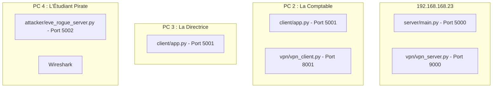

# Guide d'Installation et de Déploiement de SecureShare

Ce guide détaille les prérequis, la procédure d'installation et la configuration réseau nécessaires pour déployer l'application **SecureShare** sur les différents ordinateurs du laboratoire de l'Université.

---

## 🛠️ 1. Prérequis Logiciels (À installer sur TOUS les PC)

Chaque ordinateur (Serveur, Comptable, Directrice, Pirate) doit disposer des éléments suivants :

1. **Python 3.10+** (téléchargeable sur [python.org](https://www.python.org/))
   * *⚠️ Attention lors de l'installation sous Windows : coche bien la case **"Add Python to PATH"**.*
2. **Librairies Python requises** :
   Ouvre une invite de commandes (cmd ou PowerShell) et exécute la commande suivante :
   ```bash
   pip install flask cryptography requests pyOpenSSL
   ```
   * *`flask` : Pour faire tourner les serveurs web.*
   * *`cryptography` : Pour toutes les opérations cryptographiques (AES, RSA, signatures).*
   * *`requests` : Pour l'envoi des messages entre clients et serveurs.*
   * *`pyOpenSSL` : Requis par Flask pour générer automatiquement le HTTPS/TLS à la volée (`ssl_context='adhoc'`).*

3. **Outil d'analyse réseau (Uniquement sur le PC de l'Étudiant Pirate)** :
   * **Wireshark** (téléchargeable sur [wireshark.org](https://www.wireshark.org/)) pour sniffer le réseau et montrer la différence entre le mode HTTP en clair (sans VPN) et le mode chiffré (avec VPN).

---

## 🛜 2. Répartition des Rôles et des Fichiers par PC

Voici comment répartir les scripts de l'application sur les machines physiques du lab :



---

## 🚀 3. Procédure de Lancement (Étape par étape)

Pour démarrer la démonstration devant le professeur, lancez les scripts dans l'ordre suivant :

### ÉTAPE A : Configurer le Serveur central (Sur le Windows Server 2019 - `192.168.168.23`)
1. Copie le dossier `shared/` (contient `crypto_utils.py`), `server/` et `vpn/` sur le serveur.
2. Ouvre deux invites de commande distinctes sur le serveur :
   * **Console 1 (Le Serveur de messagerie Flask)** :
     ```bash
     python server/main.py
     ```
     *(Le serveur va tourner sur le port `5000` en HTTPS/TLS)*
   * **Console 2 (Le Déchiffreur du Tunnel VPN)** :
     ```bash
     python vpn/vpn_server.py
     ```
     *(Le serveur VPN écoute sur le port `9000`)*

---

### ÉTAPE B : Configurer le poste de La Directrice de l'Université
1. Copie le dossier `shared/` et `client/` sur son PC.
2. Ouvre une invite de commandes et lance le client :
   ```bash
   python client/app.py
   ```
   *(Le client tourne localement sur le port `5001`)*
3. Ouvre un navigateur et saisis l'adresse : `http://localhost:5001`
4. Dans l'interface, configure le rôle sur **"Directrice"**. Son interface va générer ses clés RSA et afficher son **Empreinte de clé publique** (ex: `B4E7-9F12-...`) à l'écran.

---

### ÉTAPE C : Configurer le poste de La Comptable du Campus
1. Copie le dossier `shared/`, `client/` et `vpn/` sur son PC.
2. Ouvre deux invites de commandes distinctes :
   * **Console 1 (L'Interface de la Comptable)** :
     ```bash
     python client/app.py
     ```
   * **Console 2 (Le Chiffreur du Tunnel VPN)** :
     ```bash
     python vpn/vpn_client.py
     ```
     *(Le client VPN écoute sur le port `8001` local)*
3. Ouvre un navigateur et saisis l'adresse : `http://localhost:5001`
4. Dans l'interface, configure le rôle sur **"Comptable"**. 
5. Renseigne l'IP du serveur dans la configuration (`192.168.168.23`).

---

### ÉTAPE D : Configurer le poste de L'Étudiant Pirate (Attaquant)
1. Copie le dossier `attacker/` sur son PC.
2. Ouvre une invite de commandes et lance le faux serveur d'annuaire (MITM) :
   ```bash
   python attacker/eve_rogue_server.py
   ```
   *(Le serveur d'attaque écoute sur le port `5002`)*
3. Lance **Wireshark** et sélectionne la carte réseau active (Wi-Fi ou Ethernet) connectée au réseau du lab. Applique le filtre de capture suivant :
   ```text
   tcp.port == 5000 or tcp.port == 9000
   ```
   *(Pour n'afficher que le trafic direct ou le trafic VPN)*

---

## 🔍 4. Vérification de la connectivité réseau du Lab
Avant la démonstration, vérifie que les machines communiquent bien entre elles :
* Depuis le PC de la Comptable, fais un ping vers le serveur :
  ```bash
  ping 192.168.168.23
  ```
* Si le ping échoue, vérifie que les **pare-feux Windows** (sur le serveur et sur les PC clients) ne bloquent pas le trafic ICMP et les ports `5000`, `8001`, `9000`. Si nécessaire, désactive temporairement le pare-feu public Windows Defender sur le Windows Server pour la durée du TP.
